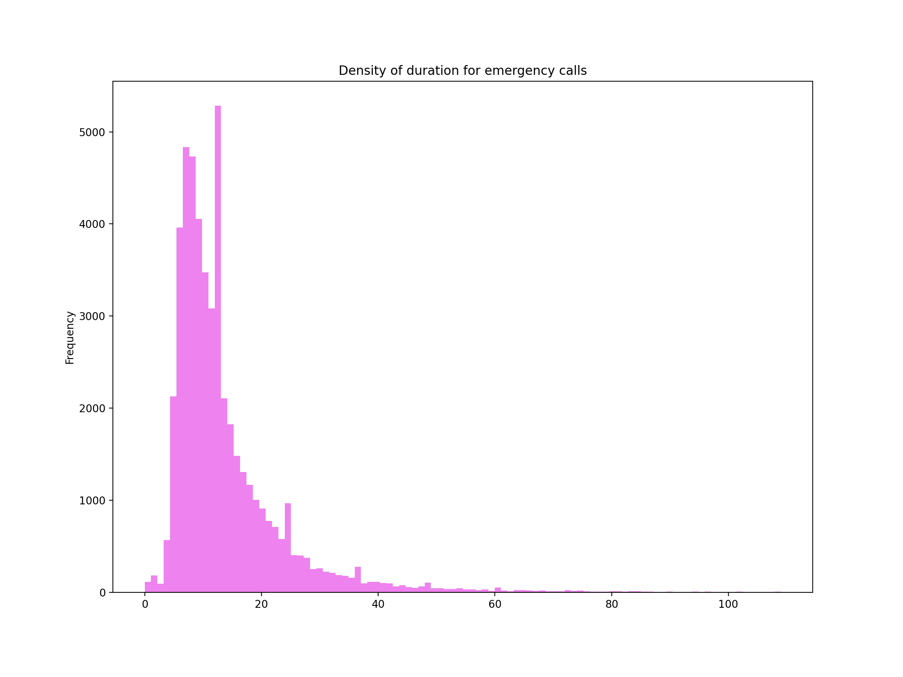
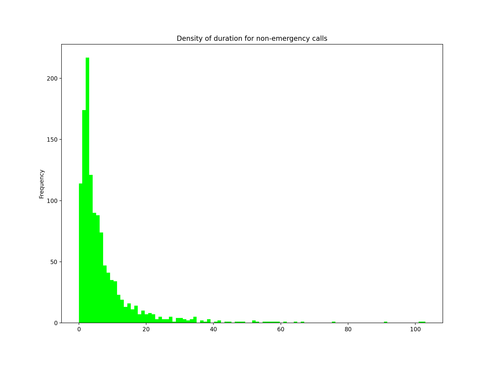
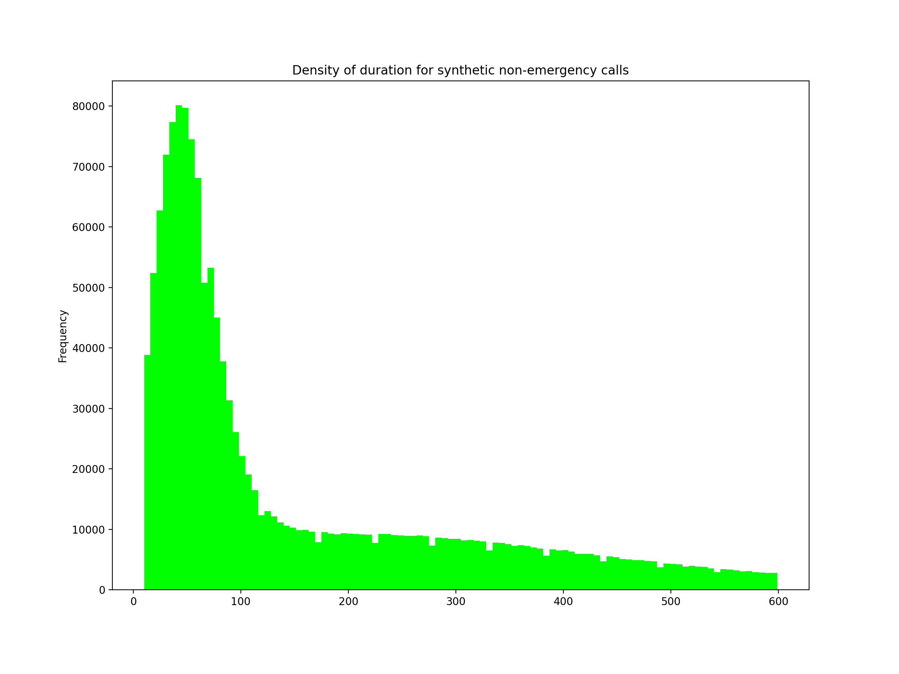
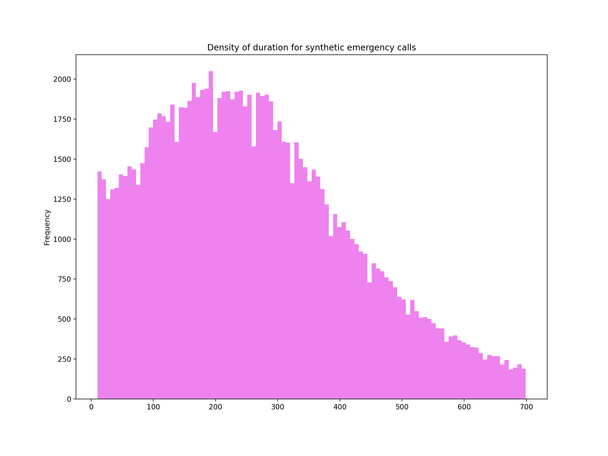

========================================
Appendix
========================================
The Perimeter data provides data on aggregate level which only includes very few pieces of
information regarding the duration of individual calls. We made a decision to assume that
the duration of calls follow a *truncated normal* distribution which in general is a
reasonable assumption. This assumption requires validation which itself requires data.

The Telus 911 dataset provides limited insight about the duration of calls that have been
forwarded to to evaluation unit, emergency or non-emergency.

In this chapter, we use the existing information to validate the assumption that a truncated
normal distribution is reliable. To this end, we measure the time between call transfer
and call disconnect. We identify the calls forwarded to *7809443700* as emergency and those
forwarded to *7809443675* as non-emergency. Of course, there bulk of non-emergency calls
referred to evaluation are coming through police non-emergency line and hence the accuracy
of the outcome is subject to further debates.

For the emergency calls, the :numref:`emr911` resembles a :math:`\Gamma` distribution that
itself can be roughly approximated as a *truncated normal distribution*.

    Density of duration of transferred calls to 7809443700

Similarly, the kernel density of the duration of calls transferred to *7809443675* is
given in :numref:`nonemr911`. This, again resembles a :math:`\Gamma` distribution
that we approximate by a truncated normal.

    Density of duration of transferred calls to 7809443675

The previously mentioned difference between the mean duration of synthetic samples and the
actual mean of Perimeter data can be explained as a result of the rough estimation of
the above kernel densities. Note that :numref:`emr911` and :numref:`nonemr911` show
a strong skewness toward the left while a truncated normal looks smoother and skewness
is not noticeable.

The density of duration for synthetic non-emergency calls is illustrated
in :numref:`nonemr_synth`

    Density of duration of synthetic non-emergency calls

The density of the duration of synthetic emergency call is given in :numref:`emr_synth`.

    Density of duration of synthetic non-emergency calls

The comparison among the above density plots shows that our synthetic sample overestimates
the duration of evaluation calls. This difference, as explained, is a result of the assumption
that the call duration follows a truncated normal distribution.

As a result of this overestimation, the outcome of the proposed analysis is leaning toward
the extreme situations where the duration of calls are longer than usual.