==========================================
Appendix B: First Come, First Serve Model
==========================================
We run the First Come, First Serve with Priority model with 4 to 11 evaluators in place,
50 random possible scenarios for each time slot to get a 95% confidence interval.
The ASAs and Utilization are as below:

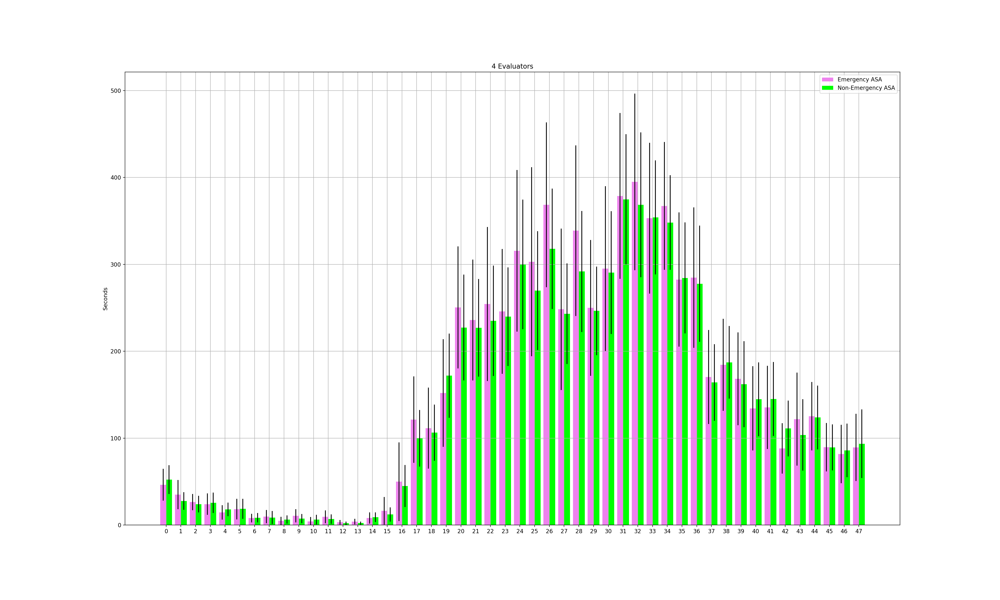

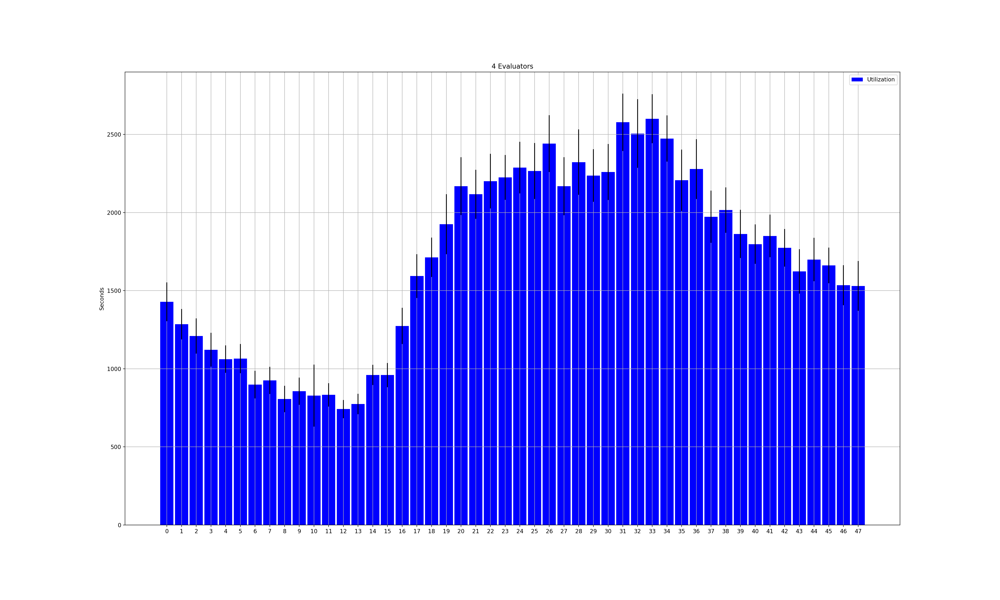

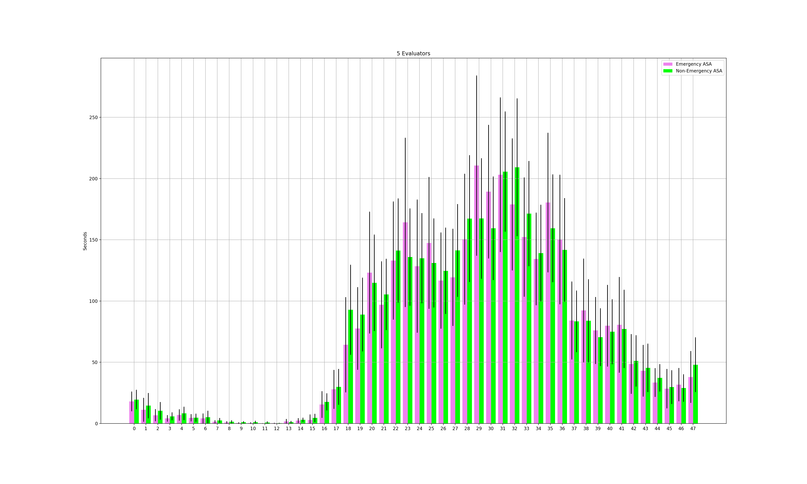

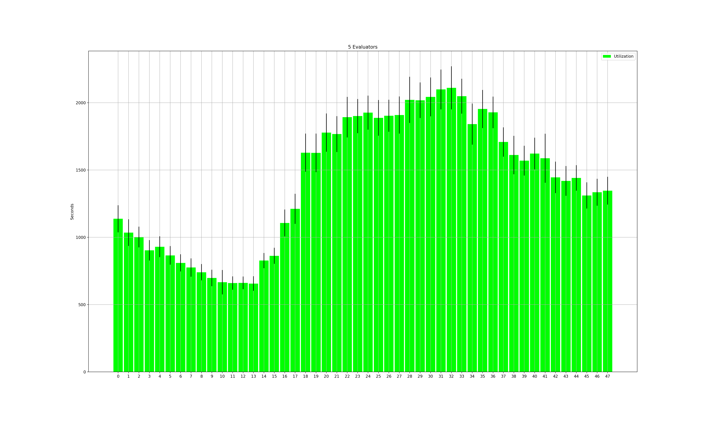

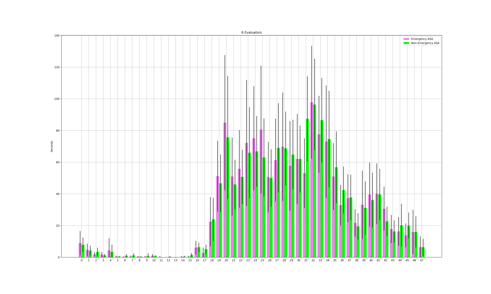

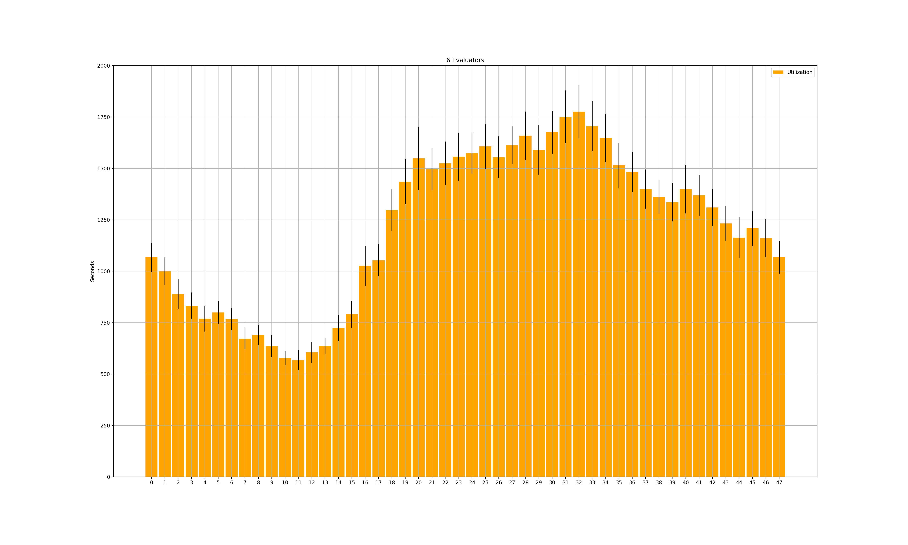

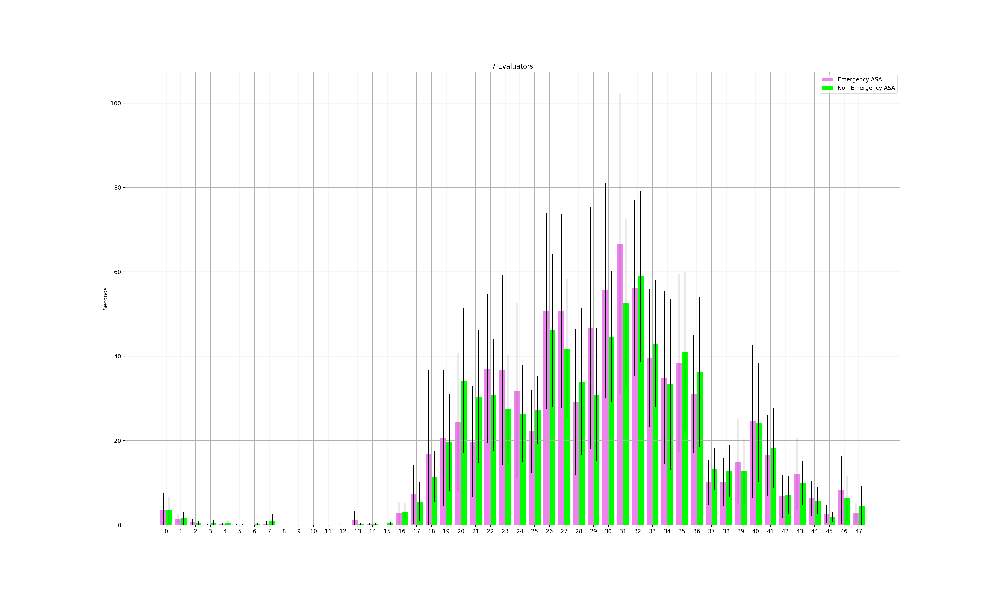

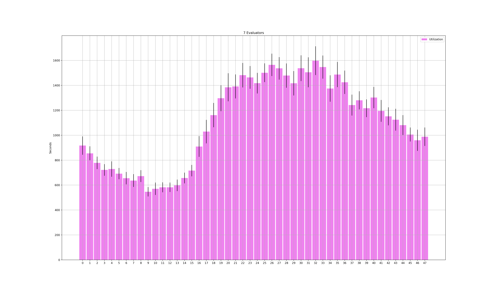

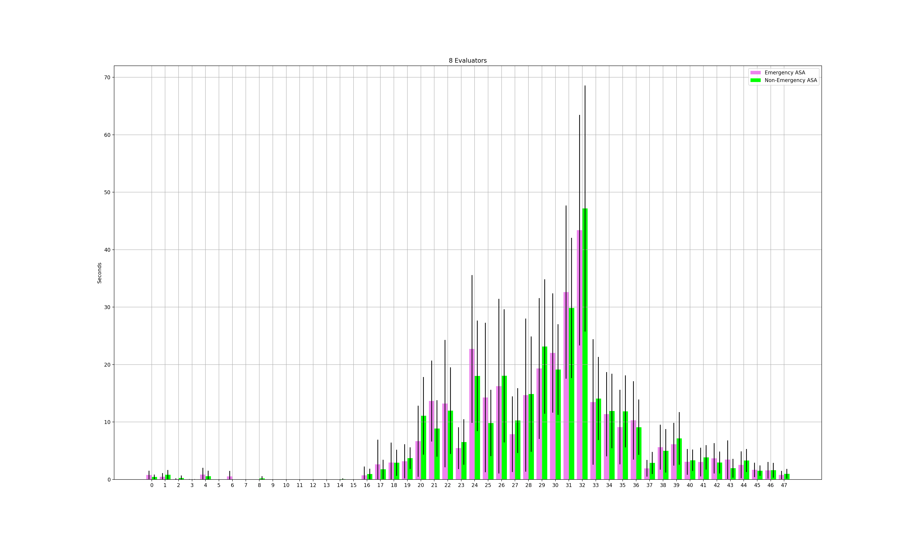

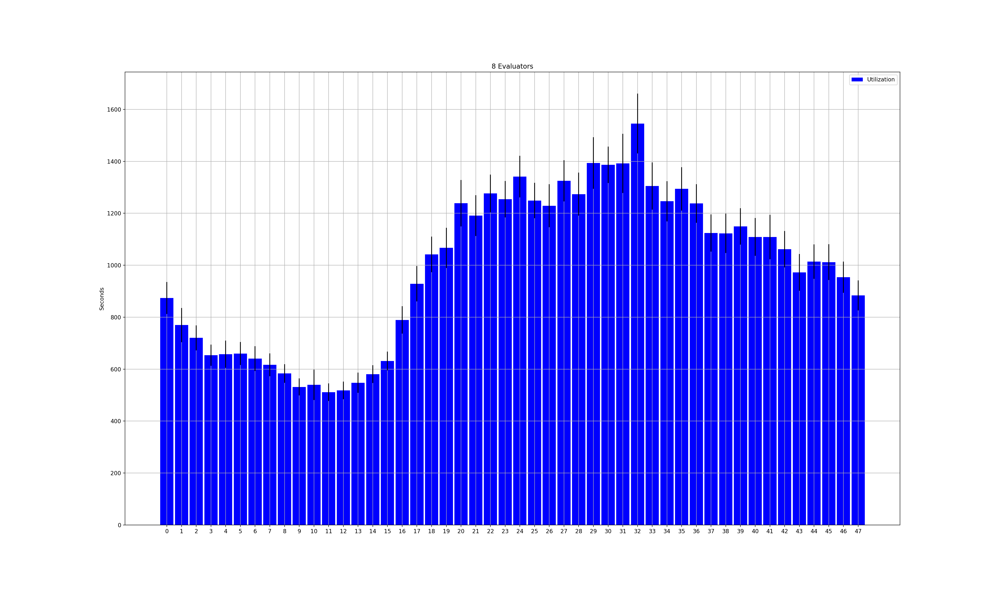

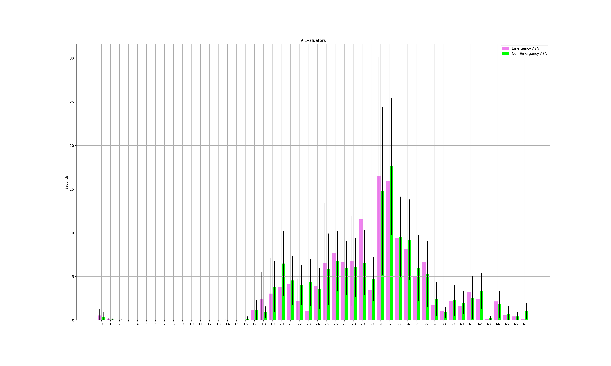

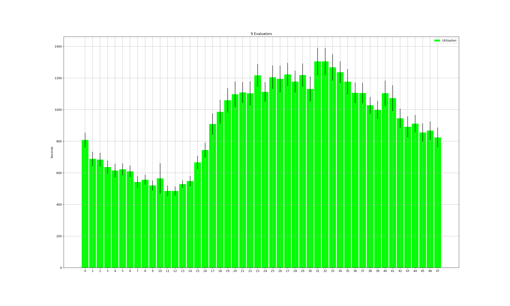

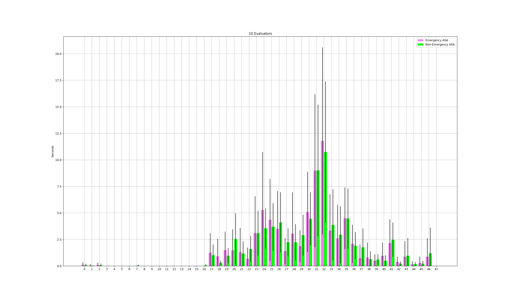

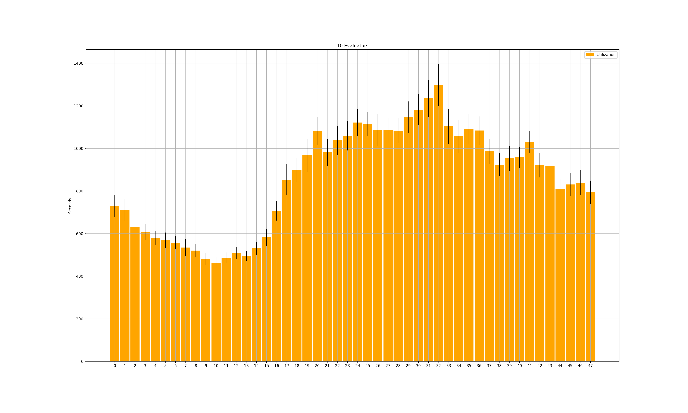

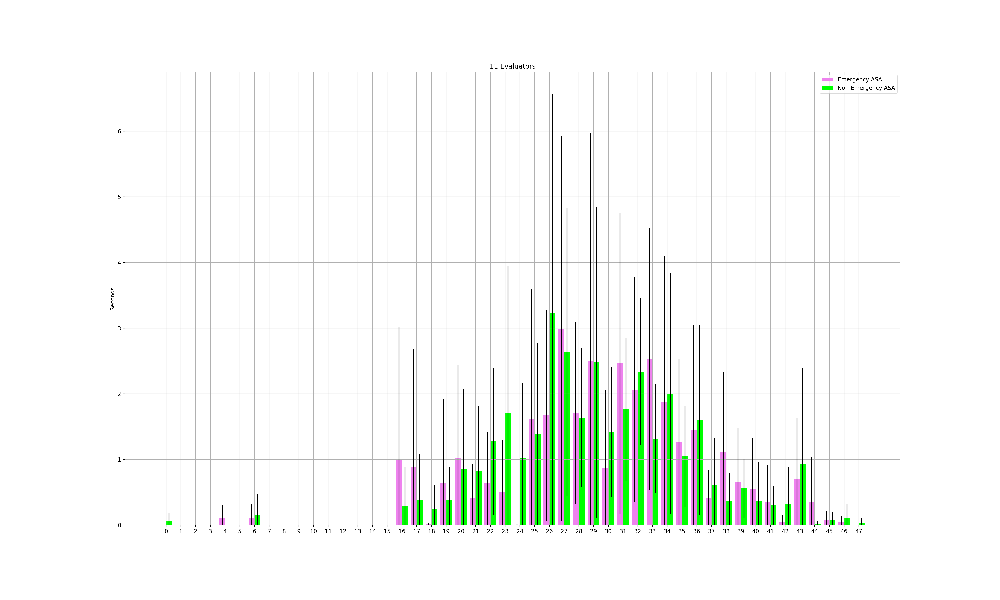

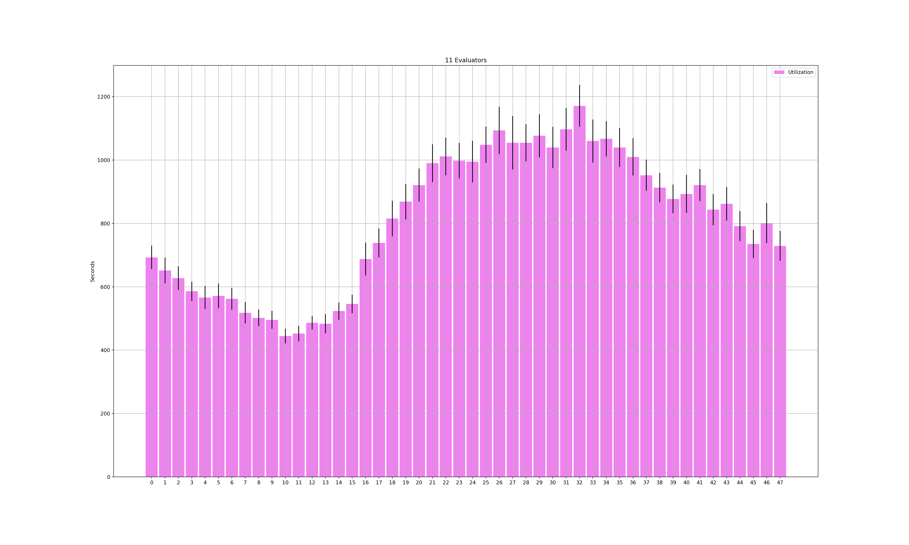
