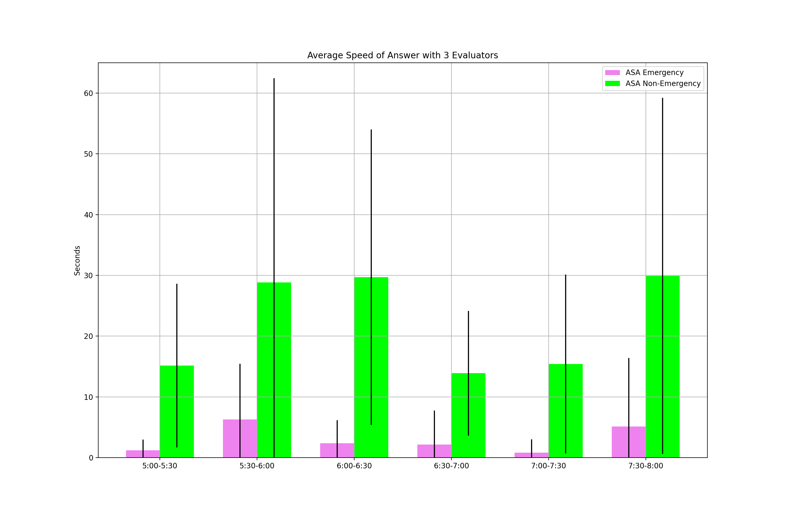
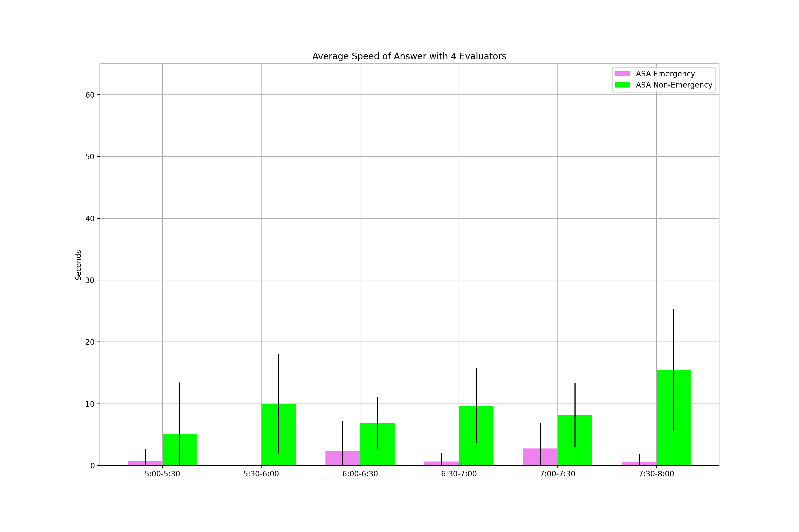
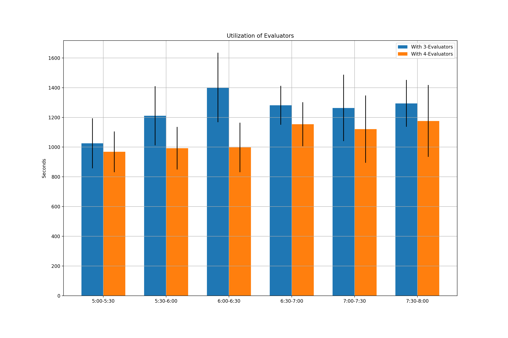

Telus and Perimeter data
==============================
The evaluation unit data is provided by Perimeter in 30-minutes aggregate format.
Hence, determining the exact workload of each agent is not a straight forward task.
Among the information in the Perimeter dataset, total duration that agents spent on calls
``t_duration``, maximum call duration ``max_duration``,
number of completed calls ``n_complete``, and number of offered and presented calls
``n_offer``, ``n_presented`` within the 30 minutes period are present.

A very basic solution to simulate the calls for each period is to take the average duration
of calls :math:`\frac{t\_duration}{n\_complete}` as the base value for the calls and proceed
from there. The following example shows why this approach is not suitable.

Example:
    Imagine a scenario where 4 high priority calls are coming through starting at 9, 10, 11,
    and 15 minutes from the start of the 30-minutes time interval with corresponding
    durations 18, 12, 15, and 15 minutes, respectively. This adds up to 60 minutes
    workload.

    Also, 10 low priority and rather short calls (3 minutes each) are received by the
    evaluation unit, which adds up to 30 minutes. Therefore the total workload for this
    time interval is 90 minutes. The average duration of each call is about 6.42 minutes
    which can be fit within the schedule for 3 evaluators. While in fact the long calls
    are overlapping which makes it impossible to fit all the above calls in the given
    time interval. :numref:`xmpl` proposes an optimal schedule that handles all
    calls given that 4 evaluators are available.

.. figure:: ./images/example4agent.png
    :width: 50%
    :align: center
    :name: xmpl

    Sample Optimal Schedule

This suggests that using the average duration of calls for analysis is not a wise
decision. At the same time, the duration distribution of calls is unknown based on the
existing Perimeter data.

.. note::
    To resolve the above issue, lets assume that the duration of calls
    are following a normal distribution :math:`\mathcal{N}(\mu, \sigma)`. The shift
    of this distribution is :math:`\mu=\frac{t\_duration}{n\_complete}`, while the
    standard deviation :math:`\sigma` is unknown. To estimate :math:`\sigma` one can
    choose either of the following solutions:

      .. figure:: ./images/normal.png
          :width: 60%
          :align: center

          Truncation of a Normal distribution

      + Assume that there is only one call with the ``max_duration`` and :math:`N=n\_complete`.
        Then the probability of having such long calls is :math:`\frac{1}{N}`.
        Solving the following equation for :math:`\sigma` provides an estimate for
        :math:`\sigma`.

         .. math::
            \int_{max\_duration}^{\infty}e^{-\frac{1}{2}(\frac{x-\mu}{\sigma})^2}~dx=\frac{\sigma\sqrt{2\pi}}{N}

      + Assume that the minimum duration is :math:`m\ge0` and the maximum duration is
        :math:`M=max\_duration`.
        The joint cumulative distribution function for the minimum :math:`m` and
        maximum :math:`M` for a sample of :math:`N` from a Gaussian distribution
        with mean :math:`\mu` and standard deviation :math:`\sigma` is

         .. math::
            \Phi\left(\frac{M-\mu}{\sigma}\right)^N-\left[\Phi\left(\frac{M-\mu}{\sigma}\right)-\Phi\left(\frac{m-\mu}{\sigma}\right)\right]^N

        where :math:`\Phi` is the standard Gaussian CDF.
        Differentiation with respect to :math:`m` and :math:`M` gives the joint
        probability density function

         .. math::
            \begin{array}{ll}
                f(m, M; \mu, \sigma) & = \\
                    & N(N-1)\left[\Phi\left(\frac{M-\mu}{\sigma}\right)-\Phi\left(\frac{m-\mu}{\sigma}\right)\right]^{(N-2)}\\
                    & \cdot \phi\left(\frac{M-\mu}{\sigma}\right)\cdot\phi\left(\frac{m-\mu}{\sigma}\right)\cdot\frac{1}{\sigma^2}
            \end{array}

        where :math:`\phi` is the standard Gaussian PDF. Taking the log and
        dropping terms that don't contain parameters gives the log-likelihood function

         .. math::
            \begin{array}{lll}
                \ell(\mu,\sigma;m, M) & = & (N-2)\log\left[\Phi\left(\frac{M-\mu}{\sigma}\right)-\Phi\left(\frac{m-\mu}{\sigma}\right)\right]\\
                & + & \log\phi\left(\frac{M-\mu}{\sigma}\right)+\log\phi\left(\frac{m-\mu}{\sigma}\right)-2\log\sigma
            \end{array}

        This expression has to be maximized numerically to find an estimate for :math:`\sigma`.

The following process explains how all the calls transferred to a line are simulated

  1. For a row, take :math:`N=\max({\rm n\_offer, n\_presented}), m=10, M=max\_duration`, and :math:`\mu=\frac{t\_duration}{n\_complete}`

  2. Find :math:`\sigma` using the above algorithms

  3. Draw :math:`N` number from the truncated distribution :math:`\mathcal{N}_m^M(\mu,\sigma)` as duration of calls

  4. Draw :math:`N` numbers between 0 and 1800 (30 minutes in seconds), uniformly as the start time of calls

  5. Combine the above numbers which simulate a hypothetical schedule according to the existing information.

Volume of incoming calls
------------------------------
To get an approximate idea about the workload throughout the day, let us distinguish
between number of *Emergency* and *Non-Emergency* calls arriving at each 30-minutes time
slot based on two years of Perimeter data (:numref:`emrvol` and :numref:`nemrvol`).

.. figure:: ./images/emrvol.png
    :width: 70%
    :align: center
    :name: emrvol

    Volume of incoming Emergency calls

.. figure:: ./images/nemrvol.png
    :width: 70%
    :align: center
    :name: nemrvol

    Volume of incoming Non-Emergency calls

A peak at the volume of calls transferred to evaluation from 911 primary :numref:`avg911`
confirms that the perimeter data and Telus data align with each other.

.. figure:: ./images/avg911.png
    :width: 70%
    :align: center
    :name: avg911

    Average volume of transferred calls from 911

To generate the volume of both Emergency and Non-Emergency incoming calls, we are
going to assume that the distribution of incoming calls per time slot follows a
normal distribution. Then we calculate the parameters of this distribution according
to the Perimeter data, plug in those values to simulate a hypothetical day for any
given 30-minutes time slot.
The following plots (:numref:`emgdist` & :numref:`nonemgdist`) show the actual
distributions extracted from Perimeter data.

.. figure:: ./images/emgdist.png
    :width: 70%
    :align: center
    :name: emgdist

    Distribution of incoming Emergency calls

.. figure:: ./images/nonemgdist.png
    :width: 70%
    :align: center
    :name: nonemgdist

    Distribution of incoming Non-Emergency calls

These plots resembles collections of **Truncated Normal** distributions which validates
the above assumption.

Stochastic Schedule Analysis
-----------------------------------
Now, we use the above information and processes to generate random calls with different
priorities for various time slots. We also assume that each evaluator takes a 2-8 minutes
**break** per 30 minutes time slot.

To get a more realistic idea about the workloads and performances, we generate 10 random
scenarios per time slot for 3 and 4 evaluators. A typical optimal schedule looks like
:numref:`typical-schedule`

.. figure:: ./images/15-4.png
    :width: 50%
    :align: center
    :name: typical-schedule

    An optimal schedule for 4 evaluators

Preliminary Results
----------------------
In this section we present the outcomes regarding the ASAs for various models with different
number of evaluators in place for all 48 time-slots.

--------------------------------------
Absolute Optimal
--------------------------------------
The preliminary analysis shows that with 3 evaluators at work the emergency ASA could go
as high as 6.3 seconds (with 95% confidence interval :math:`[0, 15,5]`).
The maximum utilization of evaluators on average is 77.8%
(95% confidence interval :math:`[64.9, 90.8]`).

With 4 evaluators, the maximum emergency ASA is 2.75 seconds (95% confidence
interval :math:`[0, 6.9]`). The maximum utilization is 65.3% (with 95% confidence
interval :math:`[51.9, 78.7]`).

.. note::
    Due to limitation on the processing, we
    only consider time intervals with low volume of calls (5:00 am to 8:00 am).
    Moreover, we run the schedule optimization for at most 5 minutes.

The Average Speed of Answering the calls for both emergency and non-emergency are
illustrated below with 3 and 4 evaluators and 95% confidence intervals
(:numref:`evals3` & :numref:`evals4`):

    ASA for emergency and non-emergency with 3 evaluators

    ASA for emergency and non-emergency with 4 evaluators

The amount of time each agent spent on calls on average is :numref:`utilization`
illustrated below with lines indicating 95% confidence intervals.

    Utilization of Evaluators

.. note::
    The model was **only** executed for hours between 5:00 am to 8:00 am, where the
    call volume is minimal, so the a machine with low resources can handle the
    computational complexity of the model within a reasonable time.
    Also, the parameters for the call duration distribution is set in a way that usually
    generates samples that on average are longer than what is being suggested by data.
    Therefore, the workload is slightly higher than what we may see in the actual
    Perimeter data.

.. note::
    The model is written in *Python 3.7* following *PEP8* standards.
    The optimization engine used for this analysis is *IBM's CPLEX*, running
    on *UBUNTU 20.04 LTS* equipped with 24 GB memory and
    Intel® Core™ i5-6300U CPU @ 2.40GHz × 4.

